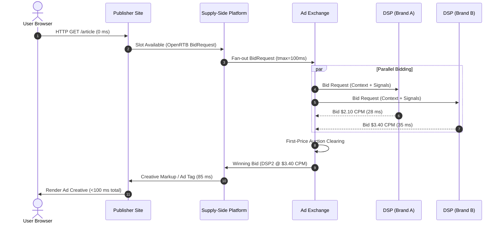
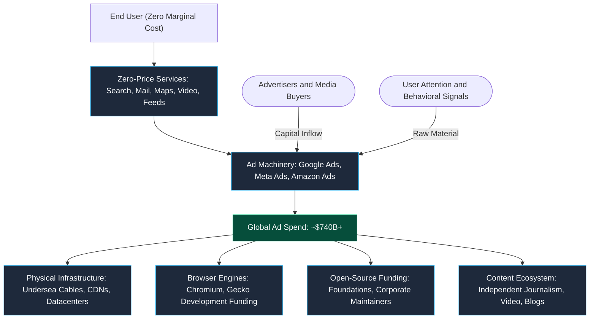

You opened this page for free. No paywall. No monthly subscription. No credit card prompt.

And yet, the server that processed your HTTP request costs money every second it idles in a datacenter. The CDN edge node that cached this asset costs money. The DNS resolver that translated the hostname costs money. Even the open-source tooling used to build the static bundle was written by engineers who have to pay rent.

So who is footing the bill?

Advertisers. More specifically, a planetary-scale distributed auction engine that prices and sells human attention in real time, settles bids in under 100 milliseconds, and processes tens of thousands of requests per second — all before your browser even finishes parsing the document `<head>`.

The internet is not free. You are the currency. And the exchange rate is denominated in the one non-renewable resource you can never manufacture more of: your attention.

## The Original Sin — October 27, 1994

The modern ad-supported web has a precise timestamp. On October 27, 1994, HotWired — the digital outpost of *Wired* magazine — published the first clickable banner advertisement. AT&T paid $30,000 to place a tiny 468×60 pixel rectangle at the top of the page that read:

> *"Have you ever clicked your mouse right HERE? You will."*

It registered an astonishing 44% click-through rate (CTR). For comparison, a modern display ad is considered high-performing if it clears 0.05%. In 1994, visitors clicked not because the creative was persuasive, but because they had never encountered an interactive advertisement before. The interaction was pure novelty.

That innocence did not last.

That same year, Netscape engineer Lou Montulli was wrestling with a fundamental architectural limitation: the web was entirely stateless. Every HTTP request arrived as a blank slate. If you added an item to a shopping cart on page one, page two had no idea who you were.

To fix this, Montulli implemented HTTP state cookies (later standardized in RFC 2109, and subsequently RFC 6265). It was an elegant session-management primitive: a small key-value pair stored on the client that the browser dutifully echoes back to the origin server in the `Cookie` header.

Nobody anticipated the vector this opened. Third-party origins embedded on thousands of unrelated domains realized they could deposit and read cookies too. An ad network script embedded across ten thousand publishers could suddenly link your browsing path across the entire web into a single unified behavioral profile — without you ever visiting that ad network directly.

A lightweight patch designed to prevent shopping carts from forgetting items became the architectural scaffolding for a trillion-dollar behavioral surveillance apparatus.

The banner ad gave the web its monetization primitive. The cookie gave it a surveillance mechanism. Together, they formed the economic foundation upon which modern consumer software was constructed.

## The Attention Auction — How RTB Actually Works

If you have ever timed the latency between clicking a search result and seeing content painted on your screen, part of that window is consumed by an automated auction with tighter service-level objectives (SLOs) than most high-frequency trading platforms.

Real-Time Bidding (RTB) is the protocol running the programmatic display ecosystem. When a page featuring an ad slot loads in your browser, the publisher's Supply-Side Platform (SSP) constructs an OpenRTB bid request payload. This JSON document details the ad placement dimensions, the page domain, content taxonomy, geographic indicators, device fingerprints, and identifier sync tokens.

The SSP broadcasts this payload across an Ad Exchange to dozens of Demand-Side Platforms (DSPs), each bidding on behalf of thousands of advertisers.

Every DSP must ingest the request, query its targeting index, score the impression value against campaign goals, execute budget pacing algorithms, and return a bid price. All of this must happen before the publisher's hard deadline expires — defined by the `tmax` parameter in the OpenRTB specification, usually between 50 and 100 milliseconds. If a DSP responds at 101 milliseconds, its bid is dropped on the floor. No retries, no backoff.



The engineering scale here is staggering. Ad Exchanges process hundreds of thousands of queries per second (QPS) at peak. DSPs maintain in-memory key-value lookups, predictive machine learning models, and complex budget engines that must return inferences in low single-digit milliseconds.

If you read my [distributed systems primer](/posts/distributed-systems-primer), you know how unforgiving latency bounds are when you introduce network hops. In finance, if an exchange lags, an order sits in a queue. In programmatic advertising, if an exchange lags, the publisher renders an empty box, the advertiser misses an impression, and revenue evaporates into the ether.

## Follow the Money

The absolute magnitude of this system is hard to comprehend until you stack the revenue figures against national economies:

| Platform | 2025 Ad Revenue (est.) | Ad Share of Total Revenue | Core Product Disguise |
| :--- | :--- | :--- | :--- |
| **Alphabet (Google)** | ~$295 Billion | ~75–80% | Search Engine, Video Platform (YouTube), Mobile OS (Android) |
| **Meta** | ~$196 Billion | ~97% | Social Network, Instant Messaging, VR Hardware |
| **Amazon** | ~$69 Billion | ~10% | E-commerce Marketplace, Cloud Infrastructure |

Look closely at Meta's numbers. Ninety-seven percent.

Meta does not build social software that happens to show ads. Meta is an advertising broker that operates social networks to generate user telemetry and screen real estate for ad delivery. Instagram, WhatsApp, and Threads are customer acquisition funnels for the ad server.

Google is only slightly more diversified due to Google Cloud, but Search and YouTube advertising remain the lifeblood funding its deep-research labs, autonomous vehicles, and browser development.

In 2024, global digital advertising spend exceeded $740 billion. That exceeds the gross domestic product of Switzerland or Sweden. An entire advanced economy's worth of capital, generated entirely by monetizing the microsecond gap between your intent to read an article and the rendering of its text.

Traditional media had a clean bargain: a newspaper charged fifty cents at the newsstand and sold print ads alongside columns. You tolerated the ads because they subsidized the paper, and the publisher knew nothing about you other than that you bought the paper at a specific kiosk. The modern web kept the subsidization model, discarded the subscription fee, and replaced passive proximity with active behavioral tracking.

## The Architecture of Dependency

For software engineers, the uncomfortable truth is not just that ad tech is lucrative. It is that advertising subsidizes the structural bedrock of the open internet.



Consider what happens if that capital inflow vanishes:

- **Browser Engines:** Google funds Chromium development to ensure its ad delivery stack has a first-class execution environment. It pays billions annually to Apple and Mozilla to remain the default search engine, single-handedly sustaining the financial viability of the Firefox ecosystem.
- **Content Creation:** The open web's long tail — tutorials, tech blogs, documentation mirrors, independent journalism — survives on programmatic display revenue.
- **Physical Infrastructure:** Google and Meta are among the largest investors in private transatlantic and transpacific undersea fiber-optic cables, building the backbone that makes global low-latency transit possible for everyone.

In [The Monolithic Secret Behind Your Microservices](/posts/the-monolithic-secret-behind-your-microservices), I wrote about how the engineering industry convinced itself that systems were fully decoupled, while quietly running every single container on top of a shared monolithic Linux kernel.

The web economy suffers from the exact same cognitive dissonance. We celebrate a decentralized, open, permissionless web of millions of independent domains. But underneath that apparent diversity sits a single, monolithic, centralized funding substrate: the advertising auction engine.

Pull that foundation out, and the open web does not gracefully downgrade. It goes dark.

## The Immune Response — Ad Blockers and the Arms Race

Users did not consent to this Faustian bargain; they simply lacked alternatives. Over the last decade, an immune response developed.

By early 2026, over **1.1 billion internet users** employ ad-blocking software. Mobile ad blocking accounts for more than 600 million active clients. In markets like Germany and Poland, desktop ad-blocking rates regularly clear 40 to 50%.

The estimated revenue loss to digital publishers hovers around **$54 billion annually**.

This creates a brutal ethical paradox:

On an individual level, running an ad blocker is strictly rational self-defense. Unchecked ad scripts balloon memory consumption, execute third-party JavaScript of questionable provenance, introduce drive-by vulnerabilities, and weaponize notifications to fragment [your scarce 4-hour deep-work cognitive window](/posts/debugging-burnout). Installing an ad blocker is the digital equivalent of locking your front door.

Collectively, however, it represents a classic tragedy of the commons. When everyone blocks ads, the zero-price model breaks. Small creators who cannot sell direct sponsorships shutter. Mid-tier news organizations erect hard paywalls. The web stratifies into a two-tier caste system: a clean, fast, ad-free experience for the affluent who can afford subscriptions, and an abusive, tracker-riddled wasteland for everyone else.

The commercial reaction has been an escalating technological arms race:

1. **Client-Side Detection:** Scripts that inspect the DOM for blocked elements or trap failed calls to common ad domains, displaying anti-adblock modals.
2. **Server-Side Ad Insertion (SSAI):** Stitching video advertisements directly into the HTTP Live Streaming (HLS) or DASH manifest at the CDN edge, neutralizing client-side domain filters.
3. **Acceptable Ads Consortiums:** The bizarre phenomenon where ad-blocking companies maintain whitelists of 'non-intrusive' formats, collecting licensing fees from ad networks to bypass their own software. The gatekeepers negotiate ransoms with the very networks they were built to dismantle.

Just like the silent drag of compounding expense ratios I analyzed in [Index Funds India](/posts/index-funds-india), where fractions of a percent quietly cannibalize long-term capital, programmatic ad intermediaries extract margins at every handoff between advertiser and publisher. The difference is that index fund fees take your money; ad networks take your attention.

## The Exits — Subscriptions, Micropayments, and Brave

If the ad-funded model is socially toxic and architecturally vulnerable, why haven't we replaced it?

Every proposed alternative breaks against economic reality:

### 1. The Subscription Ceiling
The most common prescription is: *"Just charge users directly."*

It works for high-value vertical publications like *The Information* or *The Financial Times*. But it fails as a generalized internet substrate due to cognitive overhead and wallet limits.

A user who reads articles across twenty different publications, watches educational video, uses an online IDE, checks weather forecasts, and runs web searches cannot maintain forty separate $5-to-$15 monthly subscriptions. A fully subscription-gated digital existence costs upwards of $200 per month — a trivial expense for a software engineer in North America, but an impossible barrier for most of the world. Subscriptions guarantee exclusion.

### 2. Micropayments: The Unit Economics Trap
For thirty years, technologists have championed micropayments: pay two cents to read an article, half a cent to stream a song.

The failure here is structural. Traditional payment rails (Visa, Mastercard, ACH) were engineered for high-trust, high-dollar transactions. With credit card processing fees hovering around 2.9% plus a $0.30 fixed charge, attempting to bill a $0.02 transaction produces a catastrophic negative margin.

Cryptographic rails and layer-2 networks like the Bitcoin Lightning Network theoretically eliminate per-transaction minimums. But they run into an insurmountable psychological hurdle: Nick Szabo's **mental transaction cost**. The cognitive effort required to decide whether a blog post is worth three cents creates more user friction than the payment itself. Users prefer the illusion of 'free' over the cognitive fatigue of micro-budgeting every click.

### 3. Client-Side Ad Matching: The Brave / BAT Experiment
The most technically compelling architectural experiment remains the Brave Browser and the Basic Attention Token (BAT).

Brave blocks third-party trackers at the network engine layer, then runs local, client-side machine learning models on your machine to match advertisements against your local browsing history. Your behavioral profile never leaves your hardware. Advertisers buy attention, users earn tokens for viewing opt-in notifications, and publishers receive BAT distributions.

It is brilliant privacy engineering. But it faces an insurmountable network effects barrier: Brave counts roughly 70 million monthly active users against Chrome's 3.5 billion. You cannot dislodge an incumbent market with an order-of-magnitude smaller footprint, especially when mainstream users demand zero onboarding friction.

Here is the unvarnished engineering diagnosis: **no alternative currently scales to replace programmatic advertising as the universal funding mechanism for the open web.**

## The Backbone You Cannot Replace — Yet

Advertising persists not because it is beloved, but because it is the only funding model ever invented that achieves **universality**. It allows a student in Nairobi and a venture capitalist in Manhattan to access the exact same search engine, the exact same documentation, and the exact same encyclopedia for zero monetary cost.

The fundamental engineering challenge of the next web era is not merely eliminating ads. It is solving the **Funding Trilemma**:

```
           [ Universality ]
          /                \
         /                  \
        /                    \
[ Privacy ] ————————————— [ Sustainability ]
```

A viable model must fulfill three criteria simultaneously:

1. **Universality:** Zero financial barrier to entry at the point of consumption.
2. **Privacy:** Zero reliance on centralized behavioral surveillance or cross-site telemetry.
3. **Sustainability:** Capable of generating hundreds of billions of dollars annually to fund physical infra, software maintenance, and creators.

Today:
- **Advertising** delivers Universality and Sustainability, but sacrifices Privacy.
- **Subscriptions** deliver Privacy and Sustainability, but destroy Universality.
- **Micropayments** preserve Privacy, but fail at both Universality and Sustainability.
- **Local Matching (Brave)** attempts all three, but lacks market scale.

In [Observer Mode from Advaita Vedanta](/posts/observer-mode-advaita), I explored the practice of recognizing that your conscious awareness is the baseline witness — *Sakshi* — distinct from the turbulent mental processes running within it.

The modern ad ecosystem reached the exact same conclusion through financial optimization. Ad tech discovered that human awareness is the ultimate scarce asset in an economy of infinite digital reproduction.

Advaita teaches you to guard that awareness. The internet's economic backbone was built to harvest it.

Until we engineer an economic primitive capable of solving the trilemma, that tension will not resolve. Treat your attention accordingly.

---

## Authoritative References & Further Reading

1. **IETF RFC 2109** — Kristol, D. & Montulli, L. (1997). *HTTP State Management Mechanism*. Internet Engineering Task Force. [RFC 2109](https://datatracker.ietf.org/doc/html/rfc2109).
2. **IETF RFC 6265** — Barth, A. (2011). *HTTP State Management Mechanism (Updated Cookie Specification)*. [RFC 6265](https://datatracker.ietf.org/doc/html/rfc6265).
3. **IAB Tech Lab OpenRTB API Specification v2.5** (2016) & **v3.0** (2018). *Real-Time Bidding Protocol Specifications*. Interactive Advertising Bureau.
4. **W3C Privacy Community Group** — *Private Advertising Technology Specifications (Protected Audience API & Attribution Reporting)*. [W3C Privacy CG](https://github.com/patcg).
5. **FTC Staff Report** (2024). *A Look Behind the Screens: Examining the Data Practices of Social Media and Video Streaming Services*. Federal Trade Commission.
6. **Zuboff, S.** (2019). *The Age of Surveillance Capitalism: The Fight for a Human Future at the New Frontier of Power*. PublicAffairs.
