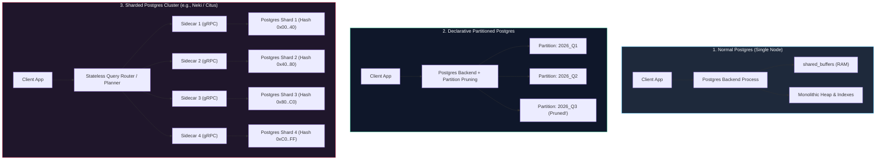
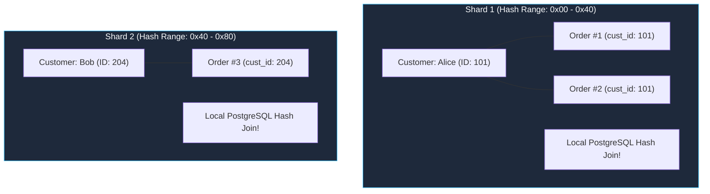

Every engineering team that manages a growing PostgreSQL database eventually embarks on the same rite of passage. 

It starts innocently. You spin up a single database instance on a cloud VM. It runs like a dream. Reads and writes take single-digit milliseconds. You add indexes. You tune `shared_buffers` and `work_mem`. 

Then the product scales. Your `orders` table crosses 100 million rows. Disk I/O creeps up. Sequential scans turn into latency spikes. Autovacuum starts thrashing. 

At this point, someone in an architecture review inevitably drops the buzzword: *"We need to shard."*

Before you dismantle your relational database into a distributed cluster of sixteen independent nodes, you need to understand what you are actually trading away. Moving from single-node PostgreSQL to a sharded architecture is not just adding more servers—it is replacing an elegant, hardware-optimized local iterator engine with a distributed systems coordinator operating over lossy network sockets.

To see why, let's trace the execution of a standard relational query across the three fundamental stages of PostgreSQL scaling: **Normal (Single-Node)**, **Declarative Partitioning**, and **Multi-Node Sharding**.

Here is our benchmark query—a standard analytical join between customers and recent orders:

```sql
SELECT customers.name, orders.total, orders.created_at
FROM customers
JOIN orders ON orders.customer_id = customers.id
WHERE orders.created_at >= $1;
```



---

## Paradigm 1: Standard PostgreSQL — The Volcano Iterator

On a single, monolithic PostgreSQL instance, our query executes inside a single OS process spawned by `postmaster`. The query lifecycle follows a battle-tested pipeline that has evolved over thirty years:

1. **Parser & Lexer:** Uses Flex and Bison (`gram.y`) to convert raw SQL text into an Abstract Syntax Tree (AST).
2. **Semantic Analyzer & Rewriter:** Verifies table names against `pg_class`, resolves data types, validates column access rights, and expands views or `RULE` definitions into a logical Query tree.
3. **Cost-Based Optimizer (Planner):** Generates multiple physical execution paths. It consults `pg_statistic` to estimate selectivity, evaluates index paths, estimates random vs. sequential page access costs (`random_page_cost`), and selects the cheapest plan.
4. **The Executor (Volcano Model):** This is where the magic happens.

### How the Volcano Model Works

PostgreSQL implements the **Volcano iterator model** (pioneered by Goetz Graefe in 1994). Every node in the physical plan tree implements an iterator interface:

```c
// Simplified representation from src/backend/executor/execProcnode.c
TupleTableSlot* ExecProcNode(PlanState *node);
```

The execution engine is demand-driven. The top-level node in our plan—a `Hash Join`—calls `ExecProcNode()` on its children to pull tuples on demand:

```text
                  -> Hash Join (Join orders.customer_id = customers.id)
                        |
       +----------------+----------------+
       |                                 |
  -> Seq Scan on customers         -> Hash (Build in-memory hash table)
                                         |
                                   -> Index Scan on orders (created_at >= $1)
```

1. The `Hash` state node iterates over the `orders` index scan, pulling matching order tuples into a hash table allocated directly in the backend process's `work_mem`.
2. Once the hash table is built, the `Hash Join` node requests tuples from `customers` one by one via `ExecProcNode()`.
3. For each customer tuple, it computes the hash of `customers.id`, probes the in-memory hash table, and emits joined rows immediately to the client socket.

### Why This Is Ridiculously Fast

Everything lives in a single shared-memory address space. If the data is cached in `shared_buffers` or the operating system's page cache, tuple transfers happen at memory bus speeds—tens of gigabytes per second with zero network latency. If an index fits in L3 cache, lookups take nanoseconds.

Transactions are coordinated locally via atomic instructions and shared locks (`LWLock`), and data durability is guaranteed by a single, append-only Write-Ahead Log (WAL) streaming sequentially to NVMe storage.

---

## Paradigm 2: In-Database Declarative Partitioning

When does single-node PostgreSQL hit a wall? 

Not when your data hits 100 GB. A modern server with 512 GB of RAM and fast PCIe Gen 5 NVMe storage will chew through a 100 GB database without breaking a sweat.

The wall hits when an individual table grows so large that:
- B-tree indexes no longer fit in `shared_buffers`, turning index traversals into random disk reads.
- `VACUUM` processes take twelve hours to scan a 500-million-row heap table, leading to transaction ID wraparound risks.
- Analytical queries scanning the last 30 days of data must traverse physical table pages intermingled with five years of historical rows.

Enter **Declarative Partitioning** (introduced in PostgreSQL 10 and matured in modern releases).

Instead of one monolithic table, you define `orders` as a partitioned table:

```sql
CREATE TABLE orders (
    id          BIGINT NOT NULL,
    customer_id BIGINT NOT NULL,
    total       NUMERIC(12,2) NOT NULL,
    created_at  TIMESTAMPTZ NOT NULL,
    PRIMARY KEY (id, created_at)
) PARTITION BY RANGE (created_at);

-- Quarterly partitions
CREATE TABLE orders_2026_q1 PARTITION OF orders
    FOR VALUES FROM ('2026-01-01') TO ('2026-04-01');
CREATE TABLE orders_2026_q2 PARTITION OF orders
    FOR VALUES FROM ('2026-04-01') TO ('2026-07-01');
CREATE TABLE orders_2026_q3 PARTITION OF orders
    FOR VALUES FROM ('2026-07-01') TO ('2026-10-01');
```

Under the hood, `orders` is now a routing abstraction. Each partition is an autonomous, physical PostgreSQL table with its own heap file, its own independent B-tree indexes, and its own autovacuum schedule.

### The Superpower: Partition Pruning

When we run our query:

```sql
SELECT customers.name, orders.total, orders.created_at
FROM customers
JOIN orders ON orders.customer_id = customers.id
WHERE orders.created_at >= '2026-09-09';
```

The PostgreSQL query planner does something remarkable: **Partition Pruning**.

1. **Compile-Time Pruning:** If the query uses a static constant timestamp, the planner compares the constant against the partition bounds in `pg_partitioned_table`. It realizes that `orders_2026_q1` and `orders_2026_q2` cannot possibly contain matching rows.
2. The planner prunes them from the execution tree completely. It produces an `Append` plan node that scans *only* `orders_2026_q3`.

```text
-> Hash Join
     -> Seq Scan on customers
     -> Hash
          -> Append
               -> Bitmap Index Scan on orders_2026_q3  <-- Only this partition!
```

3. **Run-Time Pruning:** If our query uses a prepared parameter (`WHERE orders.created_at >= $1`), compile-time pruning cannot determine the target partition. But the moment the client issues `Bind` with the actual timestamp parameter, the executor performs run-time pruning inside `ExecInitNode`, skipping the unneeded child tables before reading a single block of disk.

### The Engineering Win

Declarative partitioning gives you 90% of the benefits of sharding with 0% of the distributed systems headache:
- Index sizes remain small and pinned in RAM.
- Dropping three-year-old historical data is a instantaneous `DROP TABLE orders_2023_q1;` rather than an expensive, lock-heavy `DELETE` that generates gigabytes of WAL.
- You preserve full ACID transactions, local foreign keys, and zero-network relational joins.

---

## Paradigm 3: Sharded PostgreSQL — The Proxy Façade

When does single-node declarative partitioning finally fail?

It fails when your write throughput exceeds the physical bandwidth of your hardware:
- You saturate the maximum IOPS of your storage subsystem.
- WAL generation exceeds 500 MB/sec, causing write stalls during checkpoints.
- You need high-availability replication across multiple global regions.

When this occurs, you are forced to shard horizontally across multiple physical machines.

Systems that shard PostgreSQL (such as PlanetScale Neki, Citus, or custom Vitess-style proxy architectures) do not alter the core PostgreSQL storage engine. Instead, they insert an intelligent **Query Router / Coordinator** between your application and a cluster of autonomous PostgreSQL shards.

```mermaid
sequenceDiagram
    autonumber
    actor Client as Application Client
    participant Router as Query Router (Coordinator)
    participant SC as Shard Sidecars (1..4)
    participant PG as PostgreSQL Shards (1..4)

    Client->>Router: Extended Protocol: Parse, Bind($1), Execute
    Note over Router: 1. Wire Ingestion & SCRAM Authentication<br/>2. AST Parse & Parameter Extraction<br/>3. Distributed Query Planning (Route Nodes)
    
    par Parallel Scatter-Gather: Fetch Customers
        Router->>SC: gRPC ExecuteRequest (SELECT id, name FROM customers)
        SC->>PG: Borrow pooled backend; Execute SQL
        PG-->>SC: Local Scan Tuples
        SC-->>Router: Stream Response Chunks
    end
    
    Note over Router: Builds In-Memory Hash Table in Router RAM

    par Parallel Scatter-Gather: Fetch Orders
        Router->>SC: gRPC ExecuteRequest (SELECT ... WHERE created_at >= $1)
        SC->>PG: Borrow pooled backend; Execute SQL
        PG-->>SC: Filtered Order Tuples
        SC-->>Router: Stream Response Chunks
    end

    Note over Router: Router Hash Join: Probes customer hash table<br/>Copies raw bytes directly into Postgres DataRows
    
    Router-->>Client: Stream Formatted DataRows
    Router-->>Client: ReadyForQuery (Complete)
```

Let's trace how our join query actually travels through this distributed machinery.

### 1. Wire Ingestion & Authentication at the Edge

Your application connects to the router using standard PostgreSQL client drivers. The router must look, act, and speak exactly like PostgreSQL.

- **SCRAM-SHA-256 Auth:** The router intercepts the TLS handshake and executes the full Salted Challenge Response Authentication Mechanism (RFC 5802) in user space. It verifies the client’s credentials against its metadata layer without needing to pass plain passwords to individual shards.
- **Extended Query Protocol:** Real application drivers do not send raw SQL text. They send an extended protocol pipeline:
  - `Parse`: The client sends the parameterized SQL statement.
  - `Bind`: The client binds the parameter (`$1 = '2026-09-09'`) and opens a server-side *Portal*.
  - `Describe`: The client requests column metadata.
  - `Execute`: The client commands execution.
  - `Sync`: The client signals the end of the transaction batch.

The router parses this stream into an internal abstract syntax tree and binds `$1`.

### 2. Shard Key Resolution & The Hash Ring

The router’s distributed planner inspects the query to determine which shards hold the data:

```json
{
  "tables": {
    "customers": { "shard_group": "main_shards", "key": "id" },
    "orders":    { "shard_group": "main_shards", "key": "id" }
  }
}
```

The database administrator configured `customers` to be sharded by `id` using a deterministic hash algorithm (like `xxhash64`), split across four shards:
- **Shard 1:** Hash range `0x00` to `0x40`
- **Shard 2:** Hash range `0x40` to `0x80`
- **Shard 3:** Hash range `0x80` to `0xC0`
- **Shard 4:** Hash range `0xC0` to `0xFF`

Here is the problem: our query asks for recent orders across *all* customers. It does not provide a specific `customer_id` or `order_id` in the `WHERE` clause. 

Because there is no shard key in the predicate, the router cannot route the query to a single machine. It must generate **Scatter-Gather Routes**, broadcasting requests to all four shards simultaneously.

### 3. Transport & The Sidecar Connection Pooler

PostgreSQL suffers from an infamous architectural limitation: **process-per-connection**. Each client connection consumes a dedicated operating system process (`postgres: backend`), taking 5 to 10 MB of memory just idling.

If a pool of twenty distributed query routers each opened direct connections to four shards, the shard instances would drown in backend processes and collapse from connection starvation.

To solve this, modern sharded architectures place an intelligent **Sidecar Proxy** on each shard host:
1. The router maintains a persistent pool of long-lived, multiplexed, bidirectional **gRPC streams** to each shard's sidecar.
2. The router wraps the SQL query and session parameters into an `ExecuteRequest` protobuf message and fires it over the stream.
3. The sidecar maintains a local pool of pre-warmed PostgreSQL connections. When an incoming gRPC request arrives, the sidecar borrows a connection, resets any dirty session state, runs the query, and streams raw results back over gRPC.

### 4. Dual Planning: The Router vs. The Shards

In a sharded architecture, planning happens twice:
- **The Router Plan:** The router decides *which* machines to call, *when* to call them, and *how* to combine the results.
- **The Local Shard Plan:** Each underlying PostgreSQL shard runs its own standard cost-based planner to execute its local slice of the query using its own local B-tree indexes and tables.

---

## The Co-Location Trap & Cross-Shard Joins

Now we arrive at the central architectural crisis of distributed databases: **the cross-shard join**.

In our schema:
- `customers` is sharded by `customers.id`.
- `orders` is sharded by `orders.id`.

A customer’s record lives on Shard 1 (because `xxhash(customer.id)` landed in `0x00..0x40`). But that customer’s orders could be scattered across Shards 1, 2, 3, and 4 (because each order generated an independent `order.id` hash).

No single PostgreSQL shard holds both sides of the join. The shards cannot join the data locally.

```text
The Router Hash Join:
Step 1: Scatter-gather 100,000 customers from all 4 shards  --> Ingest into Router RAM
Step 2: Build in-memory hash table in router memory
Step 3: Scatter-gather 300,000 orders from all 4 shards     --> Stream into Router
Step 4: Router probes hash table row-by-row and joins data
```

### What Happens When Memory Runs Out?

If your customer table contains 10 million rows, that hash table will not fit in the router's memory buffer.

When the router exceeds its memory budget, it must execute a **Disk-Spill Join**:
1. It partitions intermediate customer and order rows by their join keys.
2. It writes temporary chunks to local SSDs on the router.
3. It loads matching chunks into memory sequentially to complete the join.

Your once-blazing-fast database query has degraded into a multi-gigabyte network scatter-gather followed by disk I/O thrashing on an intermediate proxy.

### Non-Distributive Aggregations & The Eval Engine

The complexity escalates if the query performs aggregations:

```sql
SELECT customers.name, AVG(orders.total) AS avg_spent
FROM customers
JOIN orders ON orders.customer_id = customers.id
GROUP BY customers.id, customers.name;
```

You cannot compute a mathematical average across shards by averaging the averages:

$$	ext{AVG}(X) 
eq rac{	ext{AVG}(X_1) + 	ext{AVG}(X_2) + 	ext{AVG}(X_3) + 	ext{AVG}(X_4)}{4}$$

A single shard might hold two orders for Customer A, while another holds fifty.

To handle this, the router’s **Evaluation Engine** must rewrite the query before dispatching it to the shards:
- It instructs each shard to calculate `SUM(orders.total)` and `COUNT(orders.total)`.
- The shards return partial sums and counts.
- The router combines the sums, combines the counts, and computes the final quotient $rac{\sum 	ext{Totals}}{\sum 	ext{Counts}}$ in user space.

---

## The Salvation: Co-located Sharding

How do you save a sharded database from the cross-shard join nightmare?

You align your physical topology with your relational data model.

Instead of sharding `orders` by `orders.id`, you shard `orders` by **`customer_id`**, using the exact same hash function and key-range distribution as the `customers` table.



When tables are **co-located**:
- Customer Alice and every single order Alice has ever placed are guaranteed to live on the exact same PostgreSQL shard.
- The router no longer needs to scatter, buffer, and join rows in memory.
- The router pushes the *entire* SQL query—joins, where clauses, aggregations—down into the physical PostgreSQL instances intact.

Each shard executes the join locally in C using its native Volcano engine, and streams fully joined result rows back to the router. The router acts as a pure passthrough multiplexer, saving thousands of CPU cycles and gigabytes of memory.

As the PlanetScale team candidly observed: **the fastest router join is the join you never have to run.**

---

## The Architectural Decision Framework

Before you shard your database, map your technical requirements against the scaling continuum:

| Feature / Metric | 1. Normal PostgreSQL | 2. Declarative Partitioning | 3. Multi-Node Sharding |
| :--- | :--- | :--- | :--- |
| **Max Practical Storage** | ~1 to 4 Terabytes | ~10 to 50 Terabytes | Hundreds of Terabytes to Petabytes |
| **Write Scalability** | Single-node IOPS limit | Single-node IOPS limit | Linearly scalable across nodes |
| **Cross-Table Joins** | Instant (In-Memory / Local IPC) | Instant (Local Volcano Engine) | Slow unless tables are co-located |
| **ACID Guarantees** | Strong, local, zero-overhead | Strong, local, zero-overhead | Distributed 2PC (Latency penalty) |
| **Connection Scaling** | Process-per-connection (Needs PgBouncer) | Process-per-connection (Needs PgBouncer) | Handled by Sidecars / Router Pools |
| **Operational Complexity** | Low (Single instance / replica) | Moderate (Partition maintenance) | Extremely High (Proxy, metadata, rebalancing) |

---

## Stop Sharding Out of Pride

In [The Monolithic Secret Behind Your Microservices](/posts/the-monolithic-secret-behind-your-microservices), I wrote about the recurring architectural irony of modern software: we spend years dismantling a clean monolithic application into hundreds of microservices, only to discover we have rebuilt a clumsy, buggy operating system across RPC calls.

Database sharding is the exact same pattern applied to storage.

When you shard PostgreSQL, you dismantle a 30-year-old, hyper-optimized relational engine running on bare-metal silicon, and you replace it with a Go or Rust proxy that has to re-invent query planning, connection pooling, transaction isolation, and hash joins over network sockets.

If you are generating petabytes of telemetry or processing 100,000 write queries per second, sharding is an indispensable engineering triumph.

If you are managing a 500 GB relational dataset with complex joins, sharding will simply introduce massive latency, operational misery, and distributed failure modes. Exhaust vertical hardware scaling. Master declarative partitioning. Optimize your indexes.

Save sharding for when the laws of physics give you no other choice.

---

## Authoritative References & Further Reading

1. **Graefe, G.** (1994). *Volcano—An Extensible and Parallel Query Evaluation System*. IEEE Transactions on Knowledge and Data Engineering. [IEEE Xplore](https://ieeexplore.ieee.org/document/277772).
2. **PostgreSQL Global Development Group**. *PostgreSQL Source Code: `src/backend/executor/execProcnode.c` (The Executor Engine)*. [git.postgresql.org](https://git.postgresql.org/gitweb/?p=postgresql.git;a=blob;f=src/backend/executor/execProcnode.c).
3. **PostgreSQL Documentation**. *Chapter 5.11: Table Partitioning and Constraint Exclusion*. [PostgreSQL Manual](https://www.postgresql.org/docs/current/ddl-partitioning.html).
4. **Darwich, A.** (2026). *The Lifecycle of a Sharded Postgres Query*. PlanetScale Engineering Blog. [planetscale.com](https://planetscale.com/blog/the-lifecycle-of-a-sharded-postgres-query).
5. **IETF RFC 5802**. *Salted Challenge Response Authentication Mechanism (SCRAM) SASL and GSS-API Mechanisms*. [RFC Editor](https://datatracker.ietf.org/doc/html/rfc5802).
6. **Stonebraker, M., & Rowe, L. A.** (1986). *The Design of POSTGRES*. ACM SIGMOD International Conference on Management of Data.
