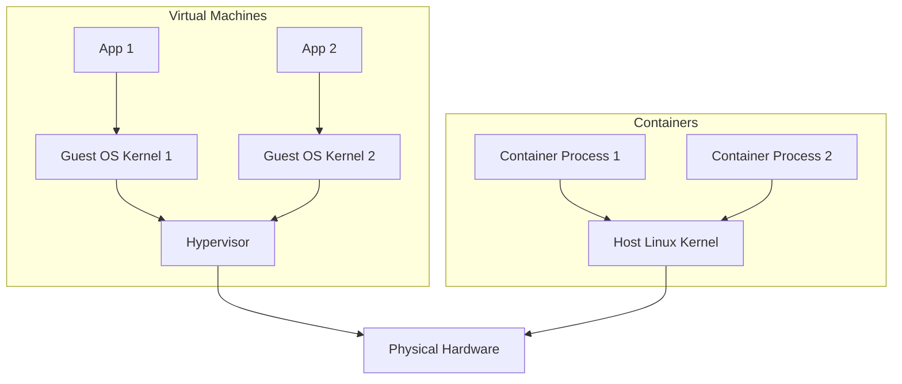
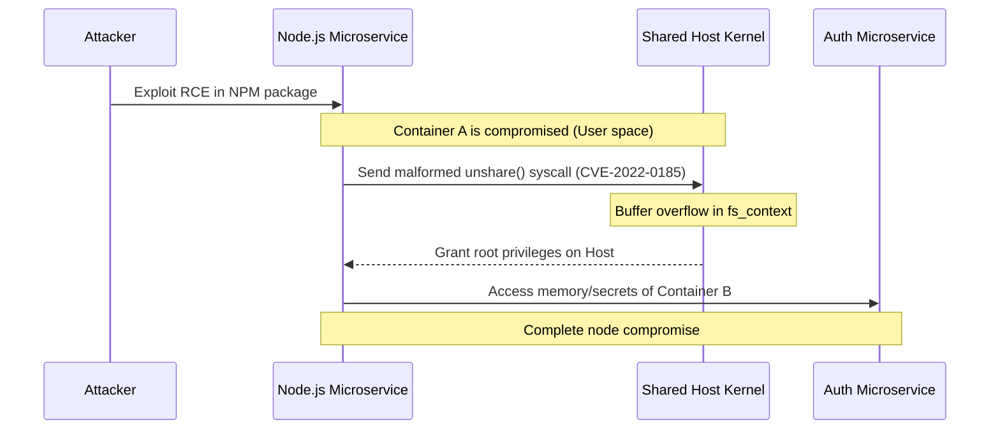

We spent the last ten years violently dismantling monolithic application architectures. The industry consensus was unanimous: monoliths are too hard to scale, too highly coupled, and too rigid for modern deployments. 

So, we broke them down. We refactored them into hundreds of elegant, decoupled microservices. We packaged them in containers. We orchestrated them with Kubernetes. We patted ourselves on the back for achieving true architectural independence.

But there is a glaring architectural irony hidden at the bottom of our tech stacks. Where do all these independent, lightweight, highly-decoupled microservices actually run? 

They run directly on top of a 30-million-line, 30-year-old monolithic C program: the Linux kernel.

## Containers Are an Illusion

To understand the irony, you have to accept a fundamental truth that the tech industry routinely glosses over: **Containers do not exist.** 

There is no physical "container" object in the Linux kernel. A container is not a lightweight Virtual Machine (VM). When you spin up a VM, the hypervisor allocates a slice of physical hardware, and you boot an entirely separate guest operating system with its own kernel. If the guest kernel panics, the host is fine.

Containers are a lie agreed upon by user-space. A Docker container or a Kubernetes pod is just a regular Linux process wearing a trench coat. It fundamentally shares the exact same monolithic kernel as the host machine and every other container on that node.



Your Go-based billing microservice and your Python-based authentication microservice might look perfectly isolated in your Git repositories, but at runtime, their system calls (allocating memory, opening files, opening sockets) are being serialized and handled by the exact same centralized kernel data structures.

## The Primitives Under the Hood

If containers aren't real, how do we get the illusion of isolation? The Linux kernel achieves this using two primary primitives: **Namespaces** and **Cgroups** (Control Groups).

### Namespaces: What You Can See
Namespaces dictate what a process is allowed to see. When a process is put into a PID (Process ID) namespace, it thinks it is PID 1. It cannot see processes running outside of its namespace. Similarly, Network namespaces give the process its own virtual network stack, and Mount namespaces give it a unique view of the filesystem.

You don't need Docker to create a container. You can isolate a process right now using the `unshare` command, which directly calls the `unshare()` system call [^1] to detach the process from the host's namespaces:

```bash
# Create a new process with its own PID, Network, and Mount namespace
sudo unshare --pid --net --mount --fork --mount-proc /bin/bash
```

### Cgroups: What You Can Use
While namespaces limit visibility, Cgroups limit resources. If namespaces are the walls of the container, cgroups are the utility meters. They ensure that a memory leak in your analytics microservice doesn't consume all the physical RAM on the host node, starving the checkout service [^2]. 

## The "Shared Fate" Problem

Because every microservice on a Kubernetes node shares the same monolithic kernel, they share the same fate. 

If a microservice triggers a rare kernel bug that causes a kernel panic, the host OS crashes. Every single "isolated" container on that node goes down with it. 

More dangerously, this shared architecture creates security vulnerabilities. Container escape attacks—like the famous CVE-2022-0185 (a heap-based buffer overflow in the Linux kernel's "File System Context" component)—allow an attacker who compromises a single, low-privilege microservice to interact maliciously with the shared kernel and gain root access to the entire host.



This is the noisy neighbor problem taken to its logical extreme. We decoupled our application logic but tightly coupled our execution environment to a massive, centralized monolith.

## Beyond the Monolith

The industry is slowly waking up to the fact that running untrusted or highly critical code on a shared kernel is a massive liability. We are looking for ways to actually isolate our microservices without paying the heavy tax of booting a full traditional VM for every service.

**MicroVMs (Firecracker):** AWS built Firecracker to solve this exact problem for AWS Lambda. Firecracker boots a stripped-down Linux microVM in roughly 125 milliseconds. It provides the hardware-level isolation of a VM with the speed and overhead of a container.

**Unikernels:** Why run a general-purpose OS at all? Unikernels compile your application code together with only the specific OS drivers it actually needs into a single, specialized, bootable machine image. 

**WebAssembly (Wasm):** Wasm is emerging as the ultimate lightweight sandbox. Wasm modules run in a highly restricted memory sandbox and must explicitly request capabilities (like file or network access) via WASI (WebAssembly System Interface) [^3]. They don't share a kernel; they share a highly secure, mathematically verified runtime.

We spent the 2010s breaking the application monolith into microservices. The defining architectural shift of the late 2020s will be breaking our dependency on the monolithic kernel. 

***

### References

[^1]: Linux Programmer's Manual, `unshare(2)` - [man7.org/linux/man-pages/man2/unshare.2.html](https://man7.org/linux/man-pages/man2/unshare.2.html)
[^2]: Linux Kernel Documentation, *Control Group v2* - [kernel.org/doc/html/latest/admin-guide/cgroup-v2.html](https://kernel.org/doc/html/latest/admin-guide/cgroup-v2.html)
[^3]: W3C WebAssembly System Interface (WASI) Specification - [wasi.dev](https://wasi.dev/)
