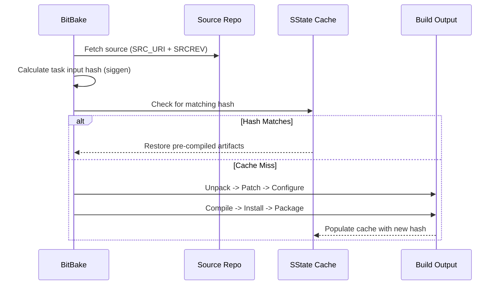

If you've spent more than a week in embedded Linux, you've probably had the "build system" argument. It usually starts when someone suggests just throwing an Ubuntu image onto an SD card and shipping it. Next, someone pitches [Buildroot](https://buildroot.org/) because it's fast and easy. Finally, someone begrudgingly whispers about the [Yocto Project](https://www.yoctoproject.org/), and half the room groans about the learning curve.

I've built systems across this entire spectrum—from quick-and-dirty [debootstrap](https://wiki.debian.org/Debootstrap) chroots to container-heavy runtimes like [BalenaOS](https://www.balena.io/os/). But when the stakes are high, when you are shipping 100,000 edge devices that will live in the field for ten years without physical access, I reach for Yocto. 

Here is a candid, deeply technical breakdown of why Yocto wins in the enterprise, where it falls flat on its face, and why building your own distribution is worth the pain.

## Under the Hood: Recipes, Tasks, and Emulation

At its core, Yocto isn't actually a Linux distribution; it's a distribution *builder*. The engine powering this is **BitBake**, a task execution engine akin to `make`, but designed explicitly for cross-compilation. 

You define your software using **Recipes** (`.bb` files). A recipe tells BitBake where to fetch the source code, what dependencies it requires, how to compile it (e.g., autotools, cmake, cargo), and exactly which files belong in the final package. BitBake resolves the dependency graph and executes tasks (like `do_fetch`, `do_compile`, `do_install`) in parallel.

One of Yocto's greatest developer-experience wins is its first-class integration with **QEMU**. You don't need physical silicon to start developing. By targeting a `qemux86-64` or `qemuarm` machine, you can bake your custom image and immediately boot it locally using the `runqemu` wrapper. You can test kernel modules, user-space applications, and network topologies purely in emulation. 

*(If you are new to this ecosystem, the [Yocto Project Quick Build Guide](https://docs.yoctoproject.org/brief-yoctoprojectqs/index.html) is the definitive starting point before diving into the [Mega-Manual](https://docs.yoctoproject.org/singleindex.html).)*

## 1. Determinism and Reproducibility: The Build Artifact Guarantee

When you build a Debian rootfs using `apt-get`, you are pulling whatever binary happens to be sitting in the upstream repository on that specific Tuesday. If a critical libc patch drops on Wednesday, your Thursday build is fundamentally different. This is a nightmare for long-term fleet management.

Yocto, via OpenEmbedded and BitBake, treats your entire OS as a deterministic equation. It tracks the exact cryptographic hash of every source tarball, every patch file, and every configuration variable. 



Through its **sstate-cache** (Shared State Cache) and **Hash Equivalence**, Yocto guarantees that if the inputs haven't changed, the output is identical. You get bit-for-bit reproducible builds across geographically distributed CI/CD pipelines. Buildroot offers determinism too, but its lack of granular caching means you are often rebuilding the world from scratch when a single package updates.

## 2. Cross-Architecture Portability and Layer Abstraction

The real superpower of Yocto is its layer model. You can completely decouple the silicon you are running on from the software you are running on it.

```mermaid
graph TD
    Distro[meta-mycompany <br> Distribution Policy] --> App[meta-myapp <br> Custom Application]
    App --> Core[meta / openembedded-core <br> Base OS Components]
    Core --> BSP[meta-imx / meta-raspberrypi <br> Board Support Package]
    
    style Distro fill:#2C3E50,stroke:#34495E
    style App fill:#8E44AD,stroke:#9B59B6
    style Core fill:#2980B9,stroke:#2980B9
    style BSP fill:#27AE60,stroke:#2ECC71
```



If you start your project on an NXP i.MX8 and, two years later, supply chain issues force you to pivot to a Rockchip or TI Sitara part, your application layer (`meta-myapp`) and your distribution policy (`meta-mycompany`) do not change. You simply swap the underlying Board Support Package (BSP) layer. 

Try doing that with a generic Debian image, where you inevitably end up hacking device trees and proprietary blobs directly into the root filesystem. Container OSes like Balena abstract this slightly by relying on Docker, but they still dictate the host OS. Yocto lets you own the *entire* stack.

## 3. License Compliance and SBOM Generation

When you ship a physical product with embedded Linux, you are legally bound by open-source licenses. If your legal team mandates "No GPLv3 in our commercial product," enforcing that manually in a Debian image is a losing battle.

In Yocto, it is literally a one-liner in your `local.conf`:
```bitbake
INCOMPATIBLE_LICENSE = "GPLv3 GPLv3+"
```
BitBake will aggressively refuse to build any recipe, or any dependency of a recipe, that violates this rule. 

Furthermore, Yocto natively generates a machine-readable Software Bill of Materials (SBOM) compliant with the [SPDX specification](https://spdx.dev/). Every package, every statically linked library, and every license is documented at build time. When a zero-day drops, you don't guess if you are vulnerable; you grep your SBOM.

## 4. Security and Lifecycle Maintenance

Speaking of zero-days, Yocto treats security as a first-class citizen. 

Using the `cve-check` class, Yocto cross-references the [National Vulnerability Database (NVD)](https://nvd.nist.gov/) against your specific build manifest during the CI run. It maps the exact versions of the packages you are building against known [CVEs](https://cve.mitre.org/).

At the toolchain level, you can globally enforce compiler hardening. You can ensure that every single binary in your rootfs is compiled with Stack Smashing Protection (SSP), Position Independent Executables (PIE), and `_FORTIFY_SOURCE=2`. 

More importantly, Yocto allows you to build an OS with a minimal attack surface. Unlike a standard Debian rootfs or a bloated container host, a Yocto image only contains exactly what you explicitly included. No rogue Python interpreters, no unnecessary systemd services listening on random ports, no default package managers waiting to be exploited.

## 5. The True Cost of Yocto

I promised a candid evaluation. Yocto is incredibly powerful, but its learning curve is a vertical cliff. 

The BitBake syntax is esoteric. Debugging a fetcher failure or deciphering why a rootfs task failed due to a phantom dependency chain will make you want to throw your laptop out a window. It requires dedicated maintenance overhead. If you don't have a dedicated DevOps or Embedded Linux engineer on the team, Yocto will eat your startup alive.

**When to choose alternatives:**
- **Choose Buildroot if:** You are building a single, static product on a known hardware platform, you don't need complex binary package management (like `rpm` or `ipk`), and you want a much simpler, `menuconfig`-driven workflow.
- **Choose Debian/Ubuntu if:** You are building an edge-gateway on an x86/ARM64 IPC, you have plenty of storage and RAM, you are deploying over a secure network, and you need data scientists to effortlessly `apt install` their Python dependencies in the field.
- **Choose BalenaOS if:** Your core competency is the containerized application, you lack kernel engineers, and you want fleet management and OTA updates solved out of the box with zero configuration.

Yocto is an industrial machine press. It takes significant time and capital to set up the tooling, but once it is dialed in, it stamps out flawless, identical, secure parts forever. If your product roadmap spans multiple hardware architectures and a decade of field deployments, Yocto isn't just the best choice—it's the only choice.

*(If you want to see what this looks like in practice, check out my [Yocto Playground on GitHub](https://github.com/gauravagarwalgarg/yocto-playground), where I experiment with minimal layers and custom configurations.)*
