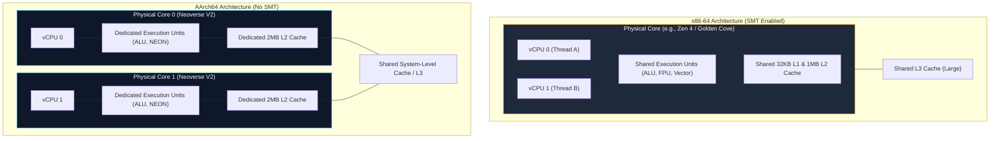

Cloud management consoles have pulled off a brilliant marketing trick: they convinced the software industry that compute is a fungible commodity.

Open the AWS, GCP, or Azure console, and you are presented with a clean table of options: 4 vCPUs, 16 GB of RAM, $0.16 per hour. Next to it sits an alternative with the exact same numbers, but powered by an ARM-based chip—AWS Graviton, GCP Axion, or Ampere Altra—priced 15% to 20% lower. The documentation suggests you can swap between x86-64 and aarch64 as effortlessly as changing a DNS record. Just recompile your Docker container, redeploy your pods, and pocket the margin.

If your entire workload consists of a stateless Python CRUD service or a Node.js API processing twenty requests a second, that abstraction holds up fine. You can stop reading here, pick the cheaper instance, and go enjoy your weekend.

The moment you scale past trivial throughput, run multi-threaded distributed state machines, operate high-performance databases, or write lock-free concurrent algorithms, that abstraction violently breaks down.

Beneath the hypervisor, x86-64 and aarch64 are not interchangeable pipelines wearing different vendor logos. They represent fundamentally opposing engineering philosophies on instruction decoding, memory consistency, cache hierarchies, and vector registers. A "vCPU" is not a standard unit of compute. It is a leaky abstraction that will happily corrupt your data or ruin your p99 tail latency if you treat it like one.

Here is the unvarnished systems engineering breakdown of what actually changes when you move between architectures, where the landmines are buried, and how to choose the right silicon for your workload.

## The Kitchen Analogy That Broke: SMT vs. Dedicated Cores

The single biggest operational difference between cloud x86-64 and ARM instances is something most engineers never see in `top`: how a "vCPU" is mapped to physical silicon.

On conventional x86 cloud instances (Intel Xeon and standard AMD EPYC), one vCPU is almost never an entire CPU core. It is an **SMT (Simultaneous Multi-Threading)** hardware thread—what Intel branded as Hyper-Threading. A single physical CPU core houses multiple execution units (ALUs, FPUs, vector pipelines), but a single instruction stream rarely keeps all of them saturated. Memory stalls and branch mispredictions leave execution ports idling. SMT exploits this by keeping two separate architectural register states on one physical core, interleaving instructions from two threads into the same execution pipeline.

Think of two line cooks working in a single kitchen. They can produce more meals per hour than one cook, but they are sharing the exact same stove, refrigerator, and cutting board. When Cook A starts searing eight pans of steaks at once, Cook B stands there holding a spatula, waiting for a burner to open up.



On an x86 cloud instance with SMT, your two vCPUs share execution units and, more importantly, share L1 and L2 caches. If the noisy neighbor running on sibling thread B triggers cache thrashing, thread A's L1 cache lines get evicted.

ARM server chips—specifically AWS Graviton (built on Arm Neoverse cores) and Google Axion—eschewed SMT entirely. **Every vCPU you buy on Graviton is a complete, unshared physical core.** Each core has its own private execution units, its own branch predictor, and its own private **2 MB L2 cache** (on Graviton4's Neoverse V2, doubled from Graviton3).

### Why This Reshapes Tail Latency (p99)

This architectural split explains why benchmark charts can be so misleading:

- **Single-Thread Peak Speed (x86 wins):** An x86 core typically features higher boost clocks (3.7 GHz to 4.0+ GHz) and aggressive out-of-order execution windows. If you have a single, isolated, batch-style query that does not share the core, it will almost always finish faster on a modern Intel or AMD core.
- **Concurrent Predictability (ARM wins):** When you run a saturated web server handling 50,000 WebSocket connections or an OLTP database running hundreds of parallel queries, x86 threads start fighting each other for execution ports and cache lines. Your median latency (p50) might look respectable, but your 99th and 99.9th percentile latencies spike violently.

On Graviton, every worker thread gets its own kitchen. autovacuum in Postgres or background GC in Go can burn an entire core at 100% utilization without stealing a single clock cycle from the core processing incoming user requests.

The x86 world has recognized this vulnerability. Intel's Sierra Forest and AMD's Bergamo (Zen 4c/5c) represent the x86 counter-offensive: dense server architectures that rip SMT out and pack 128 to 192 physical cores onto a socket. But for the standard cloud instance pools you deploy today, the rule holds: **x86 gives you shared threads; ARM gives you private silicon.**

## Total Store Order vs. Weak Memory: The Heisenbug Graveyard

If SMT is a performance consideration, memory consistency is a correctness minefield.

This is the single nastiest trap in modern systems programming. A codebase written in C++, Go, or Rust can run in production on x86 for five years without a single hitch, pass millions of automated integration tests, and then mysteriously corrupt state within two hours of being deployed to a Graviton cluster.

The culprit is the **hardware memory consistency model**.

### x86-64: Total Store Order (TSO)

x86 enforces a strong memory model known as **Total Store Order (TSO)**. Under TSO, the hardware provides strict, implicit guarantees:
1. Stores are never reordered with other stores (Store-Store ordering is preserved).
2. Loads are never reordered with other loads (Load-Load ordering is preserved).
3. Stores from a single core become visible to all other cores in a globally consistent order.

The only reordering x86 hardware permits is that a local load can execute before an earlier store to a *different* address that is still sitting in the local store buffer (Store-Load reordering). Because of TSO, lazy or sloppy lock-free code that omits explicit memory fences frequently works by accident. The silicon quietly cleans up the developer's mistakes.

### AArch64: Weak Memory Ordering

AArch64 employs a **weakly ordered memory model**. The CPU pipeline is allowed to reorder almost *any* memory access—loads with loads, stores with stores, loads with stores—provided that single-threaded program logic (data dependency) is respected.

If two writes touch different memory addresses, the ARM out-of-order execution engine and store buffers can commit them to the cache hierarchy in whatever sequence maximizes pipeline efficiency.

```mermaid
sequenceDiagram
    autonumber
    participant Core0 as Core 0 (Producer Thread)
    participant Bus as Interconnect & Memory
    participant Core1 as Core 1 (Consumer Thread)

    Note over Core0,Core1: Target Logic: Core 0 writes payload Data=42, then sets Flag=1.<br/>Core 1 polls Flag; once Flag==1, it reads Data.

    rect rgb(15, 23, 42)
        Note over Core0,Core1: Scenario A: Under x86-64 (Total Store Order)
        Core0->>Bus: Store Data = 42
        Core0->>Bus: Store Flag = 1 (Hardware PRESERVES store order)
        Bus->>Core1: Flag = 1 arrives
        Core1->>Bus: Load Data (Guaranteed to observe 42)
    end

    rect rgb(35, 10, 15)
        Note over Core0,Core1: Scenario B: Under AArch64 (Weakly Ordered - Missing Barriers)
        Core0->>Bus: Store Flag = 1 (Hardware reordered stores in buffer!)
        Bus->>Core1: Flag = 1 arrives early
        Core1->>Bus: Load Data (Reads before Core 0's write reaches memory)
        Bus-->>Core1: Returns uninitialized garbage (0)!
        Core0->>Bus: Store Data = 42 (Arrives too late!)
    end
```

Look at the failure in Scenario B. In your source code, you wrote:

```c
// Thread 1 (Producer)
shared_data = compute_heavy_payload(); // Line 1
is_ready = 1;                          // Line 2

// Thread 2 (Consumer)
while (!is_ready) { /* spin */ }       // Line 3
process_data(shared_data);             // Line 4
```

On x86, this naive spinlock pattern almost always works because the store to `shared_data` is guaranteed to hit memory before `is_ready`.

On AArch64, the processor looks at `shared_data` and `is_ready`, sees that they reside at different addresses, and decides that flushing `is_ready = 1` out of the store buffer first saves two clock cycles. Thread 2 sees `is_ready == 1`, exits the loop, reads `shared_data`, and ingests garbage.

To make this safe on ARM, you cannot rely on plain assembly `MOV` instructions. You must instruct the hardware to emit explicit acquire-release semantics:

- **`STLR` (Store-Release):** Ensures all previous memory writes are globally visible before this store commits.
- **`LDAR` (Load-Acquire):** Ensures no subsequent memory reads can be speculated before this load completes.
- **`DMB ISH` (Data Memory Barrier, Inner Shareable):** A full hardware fence that stalls the pipeline until prior accesses drain.

In high-level languages like Rust (`std::sync::atomic::Ordering::Release`) or C++ (`std::memory_order_acquire`), the compiler maps these primitives to the right instructions. But if your team maintains custom lock-free queues, ring buffers, or legacy C concurrency primitives, testing on an x86 laptop proves absolutely nothing. You are testing the hardware's safety nets, not your code's correctness.

As I explored in [Linux Kernel Modules: Building from Scratch](/posts/linux-kernel-modules), kernel engineers have had to deal with memory barriers (`smp_mb()`, `smp_load_acquire()`) since the inception of multi-core SMP. When moving user-space infrastructure to ARM, those low-level primitives suddenly become your problem too.

## The Vector Width Divide: AVX-512 vs. NEON and SVE

If you are running compute-heavy analytical pipelines, vector databases, or machine learning inference, the architectural decision swings sharply in favor of x86.

SIMD (Single Instruction, Multiple Data) execution allows a single CPU instruction to apply the same arithmetic operation across an entire array of values simultaneously. The throughput of SIMD is dictated by the physical bit-width of the processor's vector registers:

| Architecture | SIMD Extension | Vector Register Width | 32-bit Floats per Instruction |
| :--- | :--- | :--- | :--- |
| **x86-64 Legacy** | SSE4.2 | 128-bit | 4 |
| **x86-64 Standard** | AVX2 | 256-bit | 8 |
| **x86-64 Server** | AVX-512 / AVX10 | 512-bit | 16 |
| **AArch64 (Graviton4)** | NEON / SVE2 | 128-bit (SVE up to 256-bit) | 4 to 8 |

AVX-512 gives modern x86 server chips (Intel Xeon Scalable and AMD EPYC 9004/9005) massive 512-bit wide registers. A single instruction can evaluate sixteen 32-bit floating-point numbers or sixty-four 8-bit integers.

### Real-World Production Impact

This register disparity is not academic; it dictates database query speed:

1. **Vector Similarity Search (`pgvector`):** When computing cosine similarity, L2 distance, or Hamming distances across dense embeddings, `pgvector` contains handwritten AVX-512 assembly paths. On ARM, it falls back to 128-bit NEON or scalar loops. For large vector indexes (HNSW, IVFFlat), x86 can outpace ARM by 2x to 3x purely on register width.
2. **Fast JSON & Text Parsing (`simdjson`):** Modern high-throughput parsers validate UTF-8 strings and locate JSON delimiter tokens by loading 64 bytes of text directly into an AVX-512 register and evaluating quotes, colons, and braces in a single cycle. Doing the same work on 128-bit NEON requires four sequential vector iterations.
3. **Bitmap Inverted Indexes:** PlanetScale's TIN index for PostgreSQL intersects 256-bit page-level bitmaps. On an x86 machine, a single AVX2 `VPAND` instruction intersects the entire 256-bit bitmap. On a 128-bit ARM core, it requires multiple operations.

### The Hidden Penalty: The AVX Downclocking Tax

There is, however, an architectural catch to x86 vector prowess. 

Firing up 512-bit execution units requires massive amounts of electrical current. On older Intel architectures (Haswell through Skylake/Cascade Lake), executing AVX-512 instructions forced the processor to drop its core clock frequency—sometimes by up to 20%—to stay within its thermal power budget (TDP). Worse, that frequency penalty affected *all* scalar code running on that core for several milliseconds after the vector instruction completed.

Modern AMD Zen 4/Zen 5 architectures and the latest Intel Xeon 6 chips have largely neutralized this frequency downclocking by implementing AVX-512 via dual 256-bit execution pipes or advanced power delivery. But the principle remains: **x86 owns raw SIMD vector throughput; ARM owns thermal consistency.**

## The 64KB Page Size Trap & Memory Allocator Bloat

When you deploy a container to an x86 Linux machine, memory paging is so predictable you never think about it: physical memory is partitioned into 4 Kilobyte pages.

On AArch64, the hardware Memory Management Unit (MMU) natively supports three distinct page granules: **4 KB, 16 KB, and 64 KB**.

Why would anyone want a 64 KB page size? **TLB efficiency.**

The Translation Lookaside Buffer (TLB) is a fast, hardware-managed cache inside the CPU core that stores virtual-to-physical address mappings. When an application accesses memory that is not cached in the TLB, the CPU must halt and execute a "page table walk"—traversing up to four levels of page directory tables in main memory to translate the address.

If you have a 128 GB Redis instance running on 4 KB pages, the operating system must track **33,554,432 distinct pages**. No TLB on earth can cache that. The CPU spends a huge percentage of its cycles stalled on page table walks.

By switching the Linux kernel to `CONFIG_ARM64_64K_PAGES`, that same 128 GB footprint requires only **2,097,152 pages**—a 16x reduction in page count. For database workloads with massive, continuous memory allocations, 64 KB pages can produce a 10% to 15% throughput improvement. This is why Red Hat Enterprise Linux (RHEL) and certain early AWS Graviton kernel builds opted for 64 KB page configurations by default.

### The Microservice Disaster: Internal Fragmentation

For small workloads, 64 KB pages are an absolute disaster.

Memory cannot be allocated in fractions of a page. If a lightweight Go microservice requests 6 KB of memory from the OS via `mmap`, the kernel must allocate an entire 64 KB page. The remaining 58 KB is dead space—a phenomenon known as **internal fragmentation**.

```
4 KB Page Granule (Standard x86):
Allocation: 6 KB  ==>  Allocates [ 4 KB ] + [ 4 KB ]  =  8 KB Total  (2 KB Wasted)

64 KB Page Granule (Some ARM64 Kernels):
Allocation: 6 KB  ==>  Allocates [ 64 KB ]            =  64 KB Total (58 KB Wasted!)
```

If you pack hundreds of microservices or ephemeral serverless containers onto an ARM host configured with 64 KB pages, your aggregate memory consumption can balloon by **300% to 500%**. Containers will trip their cgroup memory limits and get OOM-killed while running code that consumes almost nothing on x86.

Furthermore, custom high-performance allocators like `jemalloc` and `mimalloc` maintain internal size-class bins based on compile-time assumptions about page size. If you deploy a binary linked against a `jemalloc` configured for 4 KB onto a 64 KB ARM kernel, it will immediately abort at runtime with an assertion failure:

```text
<jemalloc>: Unsupported system page size (65536)
```

To survive on modern ARM Linux, always verify your target environment with `getconf PAGE_SIZE`, and ensure any custom allocator is compiled with `--with-lg-page=16` ($2^{16} = 64	ext{ KB}$) so it dynamically adapts at runtime.

## The Migration Minefield: C `char` Signedness and Binary ABIs

When teams plan cross-architecture migrations, they budget time for Docker multi-arch builds (`docker buildx`), third-party shared libraries, and CI/CD pipelines.

They almost never budget time for C compiler ABI specifications.

### The Signed `char` Nightmare

In the ANSI C standard, the signedness of the plain `char` type is left **implementation-defined**. The compiler is legally permitted to treat `char` as either signed or unsigned:

- **GCC / Clang on x86-64:** Defaults to `signed char` (`-fsigned-char`). Values range from `-128` to `127`.
- **GCC / Clang on AArch64:** Defaults to `unsigned char` (`-funsigned-char`). Values range from `0` to `255`.

Consider what happens to the byte `0xFF`:

```c
char c = 0xFF;

if (c < 65) {
    // Evaluates TRUE on x86-64  (c == -1, and -1 < 65)
    // Evaluates FALSE on AArch64 (c == 255, and 255 > 65)
}
```

This single architectural quirk brought down production PostgreSQL clusters. The popular `pg_trgm` extension used plain `char` variables to sort three-character text trigrams inside its GiST and GIN indexes.

When a team set up a secondary replica on ARM64 and streamed write-ahead logs (WAL) from an x86 primary, the database appeared to replicate cleanly. But because byte `0xFF` sorted before 'A' on x86 and after 'A' on ARM, the B-tree search invariants were corrupted on the replica. Queries running on the ARM replica returned missing rows and false negatives. PostgreSQL had to issue a formal architectural fix (in commit `E1tlXkn-000VZr-2D`) to explicitly cast characters to `unsigned char`.

This illustrates an immutable rule of systems architecture: **you cannot safely perform physical, byte-for-byte disk or WAL replication across different CPU architectures.** If you migrate databases between x86 and aarch64, you must use **logical replication**, forcing the destination system to re-index rows using its own local collation and comparison semantics.

As I documented in [Unleashing the Power of the Yocto Project](/posts/unleashing-yocto-project-custom-linux), cross-compilation across ISAs isn't just about targeting a new instruction set—it is about managing thousands of subtle ABI assumptions embedded across your toolchain and runtime libraries.

## The Architectural Decision Matrix

When you strip away cloud marketing and vendor benchmarks, the decision between x86-64 and aarch64 reduces to clear, mechanical criteria:

| Workload Characteristic | Recommended Architecture | Primary Technical Justification |
| :--- | :--- | :--- |
| **High-Concurrency Web APIs & Microservices** | **AArch64** (Graviton / Axion) | No SMT; dedicated physical cores and 2MB private L2 minimize p99 tail latency. |
| **OLTP Databases (Read/Write Concurrency)** | **AArch64** | Clean core isolation prevents background tasks (autovacuum, checkpointing) from stealing query cycles. |
| **Vector Databases & Embeddings (`pgvector`)** | **x86-64** (Zen 4/5, Xeon 6) | Native 512-bit vector registers (AVX-512) outperform 128-bit NEON by 2x+ on distance math. |
| **High-Throughput Parsing (`simdjson`, columnar)** | **x86-64** | AVX2/AVX-512 processes 32 to 64 bytes of raw text per instruction. |
| **Single-Threaded Batch Processing** | **x86-64** | Higher peak single-core clock frequencies (up to 4.0+ GHz boost) finish serial tasks faster. |
| **Untested Legacy Concurrency / Lock-Free Code** | **x86-64** | Total Store Order (TSO) hardware guarantees protect against subtle missing barrier bugs. |
| **Massive In-Memory Datastores (Redis, Large DBs)** | **AArch64** (with 64KB pages) | 64KB page granules drastically reduce TLB misses and page directory walks. |
| **Dense Multi-Tenant Micro-Containers** | **x86-64** (or 4KB AArch64) | 4KB standard page size avoids catastrophic internal memory fragmentation. |

## Hardware Abstractions Always Leak

In [The Monolithic Secret Behind Your Microservices](/posts/the-monolithic-secret-behind-your-microservices), I wrote about the architectural irony of the modern cloud: we spent fifteen years creating lightweight, decoupled, abstracted containers, only to run every single one of them on top of a shared monolithic Linux kernel.

The "vCPU" is the next layer of that same cognitive dissonance. We treat cloud compute as an abstract utility—a fungible dial we can twist to add more raw horsepower to our systems.

It isn't.

Hardware is not an invisible implementation detail. The physical arrangement of your silicon—whether two threads share an execution port, whether stores commit in program order, whether a page granule is 4 KB or 64 KB—dictates the stability, predictability, and correctness of the software you run on top of it.

ARM has conquered mobile, edge computing, and is systematically eating the multi-tenant cloud because its lack of SMT and superior power efficiency make it a peerless engine for high-concurrency scale. But x86 remains an astonishingly powerful, specialized beast for raw vector crunching, single-threaded dominance, and strong memory guarantees.

Stop choosing instance types based on the price-per-hour column in your cloud billing console. Measure your workload's concurrency, inspect your memory access patterns, audit your lock-free concurrency, and choose the silicon your architecture actually demands.

---

## Authoritative References & Further Reading

1. **Arm Architecture Reference Manual Armv9-A** — Arm Ltd. *Section B2: The AArch64 Application-Level Memory Model* (Detailed semantics of `LDAR`, `STLR`, and weakly-ordered memory barriers).
2. **Intel 64 and IA-32 Architectures Software Developer’s Manual** — Intel Corp. *Volume 3A, Chapter 8.2: Memory Ordering* (Formal specification of Intel Total Store Order / TSO).
3. **AWS Graviton4 Architecture Whitepaper** — Annapurna Labs & Amazon Web Services (2024). *Neoverse V2 implementation, 2MB private L2 cache hierarchy, and core scaling*.
4. **Linux Kernel Documentation** — Howells, D., McKenney, P. E., et al. *Linux Kernel Memory Barriers (`Documentation/memory-barriers.txt`)*. [kernel.org](https://www.kernel.org/doc/Documentation/memory-barriers.txt).
5. **PostgreSQL Bug Fix Commit `E1tlXkn-000VZr-2D`** — Tom Lane (2024). *Fix `pg_trgm` sign-extension bugs on architectures where `char` is unsigned*. [PostgreSQL Git](https://git.postgresql.org/gitweb/?p=postgresql.git;a=commit;h=efa08fda).
6. **Jemalloc Issue Tracker #1301** — *Memory overhead and fragmentation on systems configured with 64KB page sizes*. [GitHub jemalloc/jemalloc](https://github.com/jemalloc/jemalloc/issues/1301).
7. **Lemire, D., & Langdale, G.** (2019). *Parsing Gigabytes of JSON per Second*. The VLDB Journal (Deep breakdown of SIMD vector register utilization in `simdjson`).
